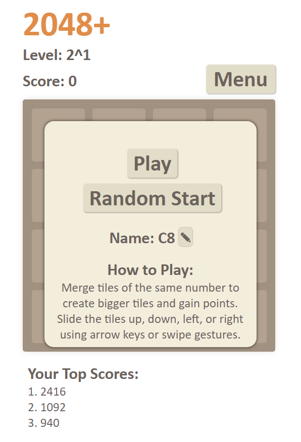
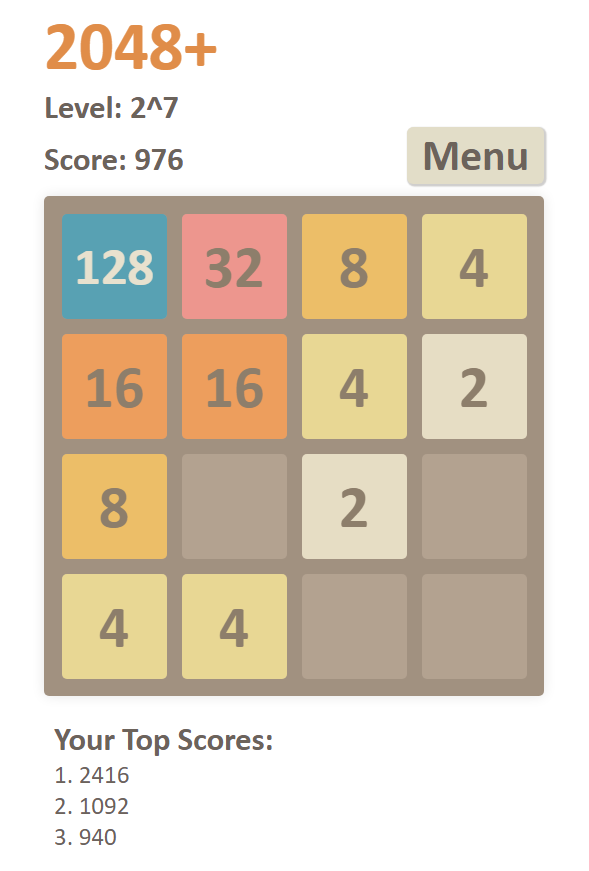

# 2048+

### [Play 2048+](https://caite21.github.io/2048/)

Recreation of the popular game [2048](https://en.wikipedia.org/wiki/2048_(video_game)) with additional features. Developed from scratch using JavaScript, HTML, and CSS. Players can use keys or swipe gestures to play, and their high scores are saved in cookies for convenience. Have fun!

 . 
