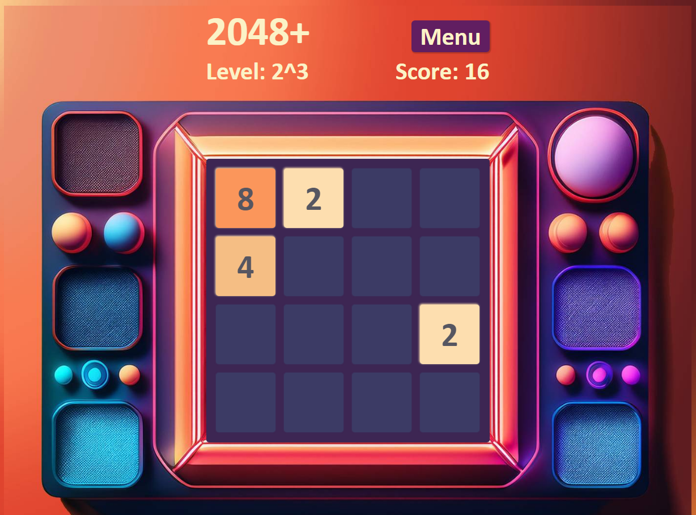

# 2048+

### [Play 2048+](https://caite21.github.io/2048/)

Redesign of the popular game [2048](https://en.wikipedia.org/wiki/2048_(video_game)) with added functionality that allows the game to start from a random state, enabling players to reach the fun part more quickly! The game was developed from scratch using JavaScript, HTML, and CSS. You can use keys or swipe gestures to play. High scores and usernames are saved in cookies. Have fun!

 
